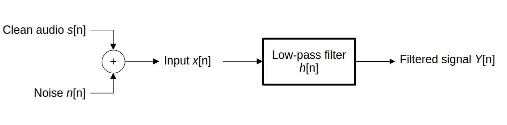
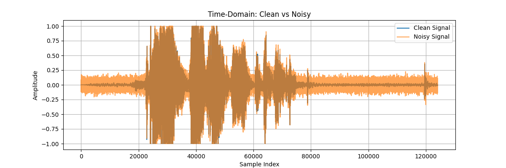
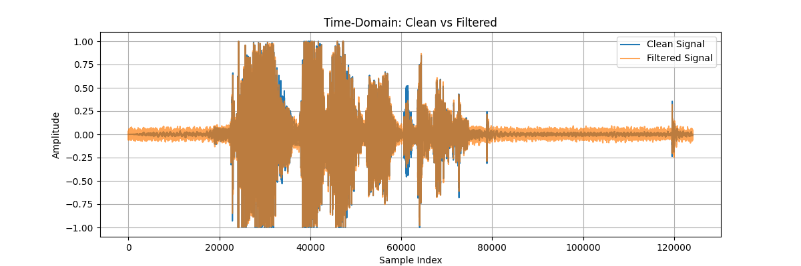

# Audio Noise Filtering with LTI Low-Pass Filter

A Python project demonstrating high-frequency noise reduction in audio signals using a discrete-time linear time-invariant low-pass filter. This project showcases the addition of artificial high-frequency noise, filtering with a moving average filter, and analysis in both the time- and frequency-domains. This was done as an extra credit for my course, but I enjoyed making it. 

---

## Table of Contents
1. [Introduction](#introduction)
2. [Problem Definition](#problem-definition)
3. [Related Work](#related-work)
4. [Overview of Approach](#overview-of-approach)
5. [Methodology](#methodology)
6. [Parameters](#parameters)
7. [Objectives](#objectives)
8. [Usage](#usage)
9. [Results](#results)

---

## Introduction
High-frequency noise in audio recordings can reduce clarity and impact human perception, speech recognition, radio astronomy, and other scientific measurements. Learning to filter such noise while preserving signal integrity is very crucial in solving these problems.

This project demonstrates a simple approach for generating, analyzing, and reducing high-frequency noise in audio signals using Python libraries. This project was done on Linux.

---

## Problem Definition
The system uses a discrete-time LTI low-pass filter applied to an audio signal with high-frequency noise.

Let:

- s[n] = clean audio signal  
- n[n] = high-frequency noise  

The noisy input signal is:

- x[n] = s[n] + n[n]

The filtering system has impulse response:

- h[n] = 1/N, for n = 0, 1, ..., N-1

where ( N ) is the filter length.  

The output signal ( y[n] ) is obtained by convolution:

- y[n] = x[n] * h[n]

<br>



---

## Related Work
- Linear filters (low-pass, moving-average) are widely used to reduce high-frequency noise while maintaining signal fidelity.
- Python-based implementations allow simulation of noise addition, filtering, and visualization in both time- and frequency-domains.

---

## Overview of Approach
1. Load a clean audio sample.
2. Generate and add artificial high-frequency noise.
3. Apply a discrete-time LTI low-pass filter (moving-average).
4. Compare signals in the time- and frequency-domains.
5. Evaluate filtering effectiveness and explore parameter adjustments.

---

## Methodology
- **Libraries Used**:
  - `numpy` for numerical operations
  - `matplotlib` for plotting time- and frequency-domain signals
  - `scipy.signal` for signal-processing utilities
  - `soundfile` for reading and writing `.wav` audio files
- **Steps**:
  1. Load audio and convert stereo to mono if needed.
  2. Add Gaussian high-frequency noise.
  3. Save the noisy audio.
  4. Plot time-domain and frequency-domain comparisons of clean vs noisy signals.
  5. Apply moving-average LTI low-pass filter.
  6. Save filtered audio.
  7. Plot time-domain and frequency-domain comparisons of clean vs filtered signals.

---

## Parameters
- **Filter Length (N)**: Controls the smoothing and high-frequency attenuation.
- **Noise Amplitude**: Determines the intensity of added high-frequency noise.
- **Sample Rate**: Affects time- and frequency-resolution.

---

## Objectives
- Reduce high-frequency noise in audio signals.
- Visualize the effect of filtering in both time- and frequency-domains.
- Test how filter parameters affect noise reduction and signal quality.
- Preserve the integrity of the original audio signal.

---

## Usage
1. Place your clean audio sample in `samples/clean_audio.wav`.
2. Run the Python script:

```bash
python3 audio_noise_filtering.py
```

---

## Results

### Time-domain plots:


- The noisy signal has the same overall shape as the clean signal, but there is a large increase in amplitude across the sample.

<br>



- The noisy signal has the same overall shape as the clean signal, compared to the noisy signal, it has a much lower amplitude but still not the same as the clean signal


### Frequency-domain plots:


- The original linear plots looked identical so I had to convert it to a logarithmic scale in order to really even see the difference. The Noisy signal has a larger span of magnitudes than the clean signal and it also remains so across higher frequencies.

<br>


- The original linear plots looked identical so I had to convert it to a logarithmic scale in order to really even see the difference. The filtered signal seems to match the same span as the clean signal in terms of magnitudes, but it introduces this new phenomena of the moving average filter's zeros. Essentially certain frequencies cancel out, mimicking a sinusoidal wave.